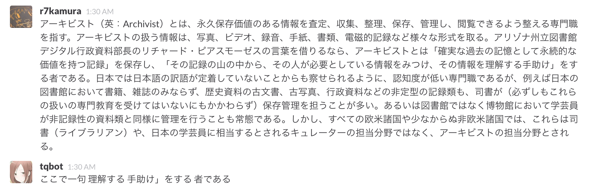

# Ruboty::Kokodeikku
[Ruboty](https://github.com/r7kamura/ruboty) plug-in to find haiku from our daily conversations.

## Usage
Requires mecab. For heroku, you can use [heroku-buildpack-mecab](https://github.com/diasks2/heroku-buildpack-mecab).

```
heroku config:set \
  BUILDPACK_URL=https://github.com/diasks2/heroku-buildpack-mecab.git\
  LD_LIBRARY_PATH=/app/vendor/mecab/lib\
  MECAB_PATH=/app/vendor/mecab/lib/libmecab.so
```


